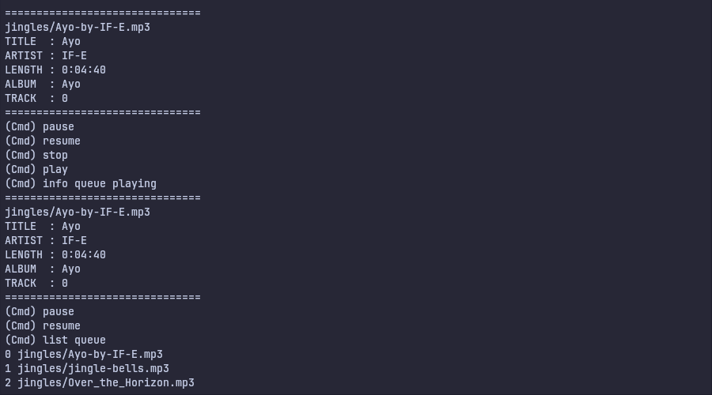

# MusicBox
##### A music player for your command line built with python.



### Description
___
MusicBox is a command line music player built completely with python programming language - Using the cmd, pygame, mutagen and other packages.

The implementation of MusicBox offers a simple text interface to interact with mp3 music files on your pc.

This project is built as the foundations portfolio and collaboration project assigned by ALX

### Installation
___
Requirements: python >= 3.8, pip, pygame, mutagen
##### Clone repsitory
```
git clone https://github.com/Ayobami0/MusicBox 

cd MusicBox
```
##### Install requirements
```
pip install -r requirements.txt
```
##### Run it
```
python main.py
```

### Quickstart
___
1. Play default songs from the jingles folder
```
(Cmd) queue
(Cmd) play
```
1. Play multiple song files
```
(Cmd) play file1.mp3 file2.mp3 file3.mp3
```

2. Add songs to queue then play them
```
(Cmd) queue file1.mp3 file2.mp3 file3.mp3
(Cmd) play
```
3. Add a preset directory (or directories) that the `queue` command can automatically use to queue songs.
```
(Cmd) preset dir1 dir2
```

4. Pause and Resume playback of a song
```
> pause
> resume
```
5. Show the information on a song
```
> info song.mp3
===============================
song.mp3
TITLE  : A Song
ARTIST : Singer
LENGTH : 0:02:30
ALBUM  : An Album
TRACK  : 99
===============================
```

### Advanced Usage
____
In order to follow the proper usage of MusicBox, it is important to understand the flow of the program and how files move from one bucket to another.

By default only the current directory and the jingles directory are registered as the directory for the program to search for songs. This behaviour can be changed or overwritten with the `preset` command, which has an optional **overwrite** option. Without the **overwrite** option, every directory preset joins the list of already existing directories.

```
(Cmd) preset dir1 dir2 overwrite

The following directories have been added for search:
        ----->   dir1, dir2
```

In order to check the directories that are preset in memory at a given time, use the command below
```
search_list
```

Having preset the directories, you can use the `queue` command to automatically queue all the songs from the preset directories into memory for you. The queue is the bucket that the MusicBox directly plays from at a given time.

```
queue
```

There can only be one existing queue at a time. To list the songs that are in the queue memory at some given point, you can use the command below

```
(Cmd) list queue

1. song1.mp3
2. song2.mp3
3. song3.mp3
4. song4.mp3
```

You can modify an existing queue into a new queue into a any form or mix of your choice using the number representation that is seen on the queue.

For instance to create a mix with song1.mp3 repeating five times, then followed by song2.mp3 two times and then song4.mp3 once:

```
(Cmd) queue 1 1 1 1 1 2 2 4 overwrite
(Cmd)
```

Note the following about the queue command:

1. The use of `overwrite` after the command. By default (i.e. without overwrite), the queue command appends any new queue to the existing queue.

2. If the queue command fails (throws an error) while using the overwrite option, the queue automatically reverts back to the former queue before the command was issued.

3. Also, using `queue overwrite` is invalid command at the moment.


To empty or clear the queue at any given time, use the `reset` command.

```
reset
```

After setting a queue, you can enter play to start the play from the begining of the queue

```
play
```

You can also play a song at a certain point on the queue.

For instance:

```
list queue

1. song1.mp3
2. song2.mp3
3. song3.mp3
```

We can start playing from song2.mp3, which is numerically reperesented by 2.

```
play
```

**Persisting the queue (Saving and Loading a queue)**


### Authors

Oludemi Ayobami is a seasoned software engineer with focus on backend engineering.... You can look him up or contact him via [Linkedin](...) or [Github](https://github.com/Ayobami0)

Akingbeni David is a software engineer with focus on backend engineering, data engineering, and machine learning engineering. You can look him up or contact him via [Linkedin](https://www.linkedin.com/in/david-akingbeni-/) or [Github](https://github.com/deelight-del/)


### Contributing guide

In order to contribute or to report any bug, kindly open a descriptive issue about the bug or contribution.

Adding an example of the bug or the intended feature or fix, is a good way to create an issue.


### License

MIT